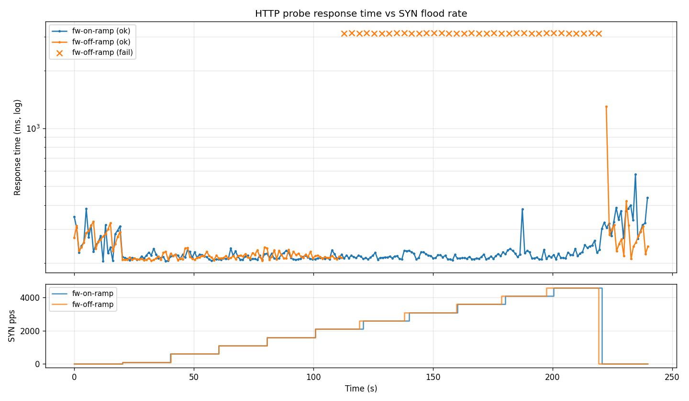

# Benchmark: SYN flood resilience

How the firewall component behaves under a sustained SYN flood, compared to the same device without the component.

## Methodology

**Device under test:** Kincony G1 (ESP32-S3, SIM7600E) running ESPHome 2026.4.0-dev on ESP-IDF 5.5.3, connected via WiFi to a LAN.

**Attack traffic:** SYN packets to TCP port 80, generated with `hping3 -S -p 80 --rand-source -i u<interval>` from a Linux host on the same LAN. `--rand-source` spoofs source IPs so (a) each SYN appears to come from a distinct "peer", simulating a distributed flood, and (b) flood packets are guaranteed not to match any trusted subnet.

**Probe traffic:** one HTTPS GET per second against the device's `web_server` (TCP port 80), issued from a WireGuard peer. The WG subnet is in the firewall's `trusted:` list, so probe traffic takes a path that is intentionally allowed through regardless of firewall state. This measures the firewall's effect on *legitimate management traffic* while untrusted traffic is being flooded. Timeout per probe is 5 seconds.

**Load profile:** 20s baseline (no flood) → ramp from 100 pps to 5000 pps in 500-pps steps, each step held for 20s → 20s recovery (flood stopped). Total ~240s.

**Configurations:** two variants of the same firmware, identical except for the presence of the `firewall:` block. Both flashed to the same device, same network, same attacker.

| Variant | `firewall:` block | Trusted |
|---|---|---|
| `fw-on-ramp` | present | `172.30.0.0/16` (WG subnet) |
| `fw-off-ramp` | removed | n/a |

## Results

| Run | Probes | Succeeded | Failed | p50 | p95 | p99 |
|---|---:|---:|---:|---:|---:|---:|
| Firewall on | 239 | 239 | 0 | 217 ms | 334 ms | 400 ms |
| Firewall off | 165 | 130 | 35 | 218 ms | 313 ms | 419 ms |
